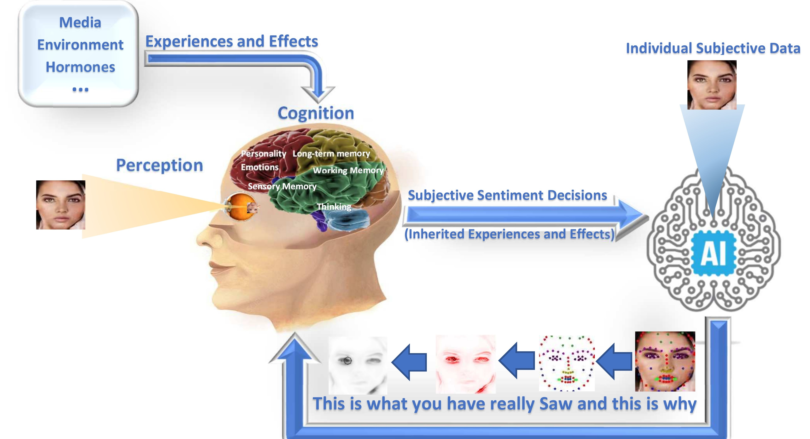

# About

:fuelpump: **will be updated soon**

Materials to reproduce the results of the paper submitted to [Journal](https://www.l): 

*[Beauty in the Eyes of Machine: A Novel Intelligent Signal Processing-Based Approach to Explain the Brain Cognition and Perception of Beauty Using Uncertainty-based Machine Voting](https://www.)*

****



## Optional files
:one: [Pre-Trained model](https://drive.google.com/file/d/1CmHLK6lPJgEa6W0Lv0ImrNuCdZ5GGBtU/view?usp=sharing) Put it under **pre_trained** folder.

:two: [VGGface-weights](https://drive.google.com/file/d/1ClyOxel9c7F7EJqzYadIOiY5mNMeKFUI/view?usp=sharing) Put it under **src** folder.


## Data
Put your data under **data** folder and follow instructions in **read.txt**

To request the data used in the paper please send email to:
<263792@email.com>


## Installation
```
git clone https://github.com/waleed-aldhahi/LSLS.git
cd LSLS
pip install -r requirements.txt  # pip install -e .
python run.py
```
## Or
```
pip install git+https://github.com/waleed-aldhahi/LSLS.git
```
## Run 
```
python run.py
```

## Citation

BibTeX entry:
```
@article{WaleedAldhahi2021,
author = {Aldhahi, Waleed and Albusair, Thekra and Sull, Sanghoon},
doi = {},
issn = {},
journal = { Journal},
pages = {},
title = {{A novel intelligent signal processing based approach to explain the brain cognition and perception of beauty}},
volume = {},
year = {2022},
}
```
